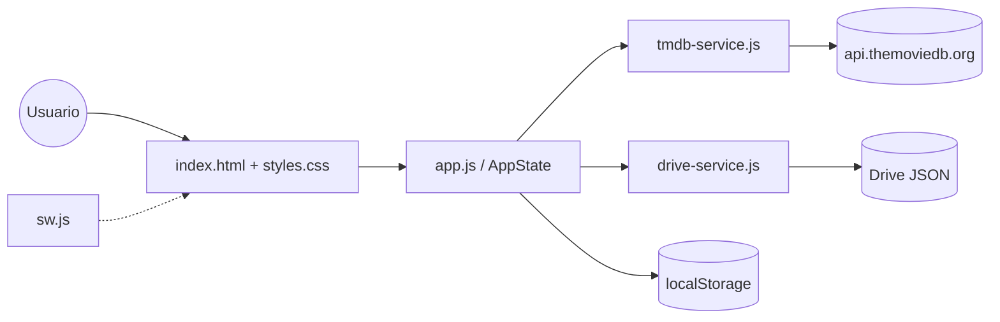
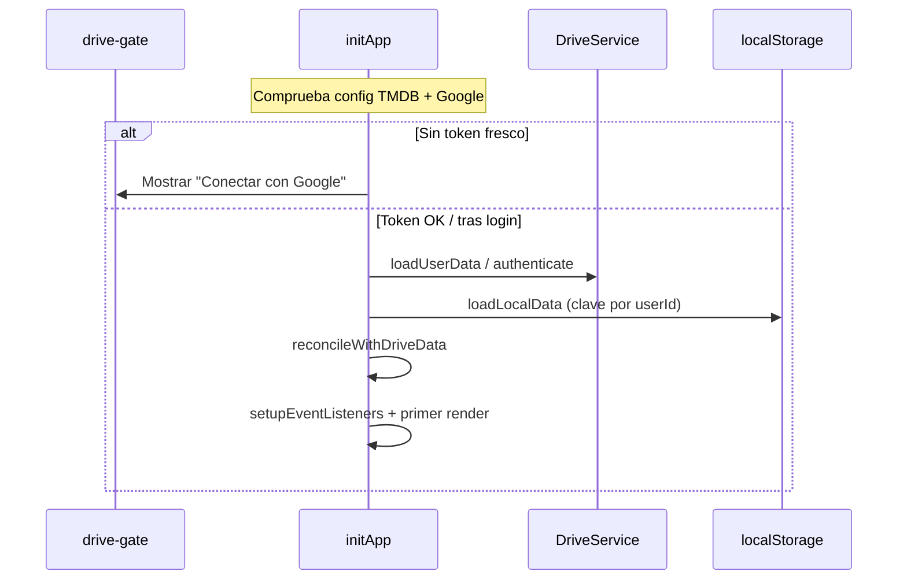

# 01 — Visión y arquitectura

← [Índice](README.md) · Siguiente: [02 Modelo de datos](02-modelo-de-datos.md)

---

## Propósito

SeenIt es una **PWA de seguimiento personal** de series y películas:

- El **catálogo** (títulos, pósteres, episodios, plataformas) viene de **TMDB**.
- La **biblioteca del usuario** (qué has visto, notas, listas, favoritos) vive en **Google Drive** del propio usuario, con espejo en **localStorage**.
- **No hay backend propio**: HTML/CSS/JS estáticos + APIs de terceros. Ideal para GitHub Pages.

Restricciones que condicionan todo el diseño:

1. Sin servidor → claves en el cliente; OAuth con `drive.file` (solo ficheros que crea la app).
2. Varios dispositivos / pestañas → hace falta **merge** (LWW + tombstones), no “último save gana a ciegas”.
3. Offline parcial → Service Worker cachea el shell; los datos de biblioteca no van en el SW.

---

## Capas

| Capa | Archivos | Responsabilidad |
|------|----------|-----------------|
| Shell | `index.html`, `styles.css`, `manifest.json`, `icons/` | Estructura DOM, chrome sticky, modales, PWA |
| App | `app.js` | Estado, vistas, timelines, sync orchestration, detalle |
| TMDB | `tmdb-service.js` | HTTP TMDB, normalización, caché de temporadas |
| Drive | `drive-service.js` | GIS OAuth, token, CRUD del JSON en Drive |
| Import | `tvtime-import.js` | Parseo de exportes TV Time |
| Config | `config.js` (no en git) | Claves; plantilla en `config.example.js` |
| Deploy | `.github/workflows/deploy-pages.yml`, `server.py` | CI Pages / servidor local |

---

## Orden de scripts

En `index.html` (final del body), el orden importa:

1. `config.js` — define `CONFIG_*`
2. `tmdb-service.js` — expone `window.TMDBService` y helpers
3. `drive-service.js` — expone `window.DriveService`
4. `tvtime-import.js` — importación
5. `app.js` — usa los anteriores; registra SW y arranca `initApp`

Si cargas `app.js` antes de los servicios, fallarán las comprobaciones de config y las llamadas globales.

---

## Arranque (`initApp`)

Flujo simplificado:

Puntos clave en `app.js`:

- `setDriveGateVisible` — oculta `#app` hasta estar autenticado (o muestra error de config).
- Biblioteca **por usuario**: clave `seenit_data__${userId}` (migración desde legacy `seenit_data`).
- Tras merge, `saveLocalData` + push a Drive según resultado (`remote` / `merged` / `local-upload`).

Detalle: [03 Persistencia y sync](03-persistencia-y-sync.md), [05 Drive OAuth](05-drive-oauth.md).

---

## `AppState` (mapa mental)

Objeto único en memoria (`app.js`). No es un framework: mutas arrays/campos y re-renderizas vistas concretas.

| Grupo | Campos | Uso |
|-------|--------|-----|
| Biblioteca | `movies`, `shows`, `lists` | Fuente de verdad en sesión |
| Tombstones | `deletedIds`, `deletedListIds` | Borrados que deben ganar en merge |
| Navegación | `currentTab`, `currentSubTab`, `currentMoviesSubTab`, `currentProfileTab` | Series / Películas / Explorar / Perfil |
| Filtros perfil | `profile*Filter`, `profile*Search`, `profile*Platform` | Biblioteca |
| Filtros películas | `moviesPendingGenreFilter`, `moviesPendingPlatformFilter`, `moviesPendingMaxRuntime`, `moviesPendingFiltersOpen` | Lista pendiente películas |
| Detalle | `selectedItem`, `selectedEpisode`, `detailCriticaEditing`, `detailRecsExpanded` | Modal ficha / episodio |
| Drive | `isDriveConnected`, `isSyncing`, `syncDirty`, `driveUserId`, `driveLoadOk` | Sync |
| Timeline | `timelineHistoryVisible`, `timelineHistoryCache`, `timelinePendingCache`, `timelineUpcomingCache` | Listas series |
| UI misc | `expandedSeasons`, `listSortMode`, `listCoverPickMode` | Acordeones / listas |

Constantes relacionadas:

- `TIMELINE_FETCH_CONCURRENCY = 8`
- `TIMELINE_CACHE_FRESH_MS = 3 * 60 * 1000`
- `SHOW_META_TTL_MS = 12 h`

---

## Patrón de UI

1. HTML define **contenedores vacíos** (`#pending-list-container`, etc.).
2. Funciones `render*` generan HTML (strings) e `innerHTML`.
3. Acciones del usuario: atributos `onclick="..."` → funciones en `window` (ver [14](14-api-global-window.md)).
4. Cambios de datos: mutar ítem → `touchUpdatedAt` / `saveLocalData` → `scheduleSyncToDrive` (salvo flushes inmediatos).

No hay componentes React/Vue. El coste es HTML string-heavy; la ventaja es cero build step.

---

## Si quieres cambiar X, toca Y

| Quieres… | Empieza en… |
|----------|-------------|
| Nueva pestaña principal | `index.html` (nav) + `switchTab` + `styles.css` |
| Nuevo campo en serie/película | [02](02-modelo-de-datos.md) + `normalizeStored*` + merge + UI |
| Nueva llamada TMDB | `tmdb-service.js` + export en `window` |
| Cambiar fichero Drive | `DATA_FILE_NAME` en `drive-service.js` (rompe compat con datos existentes) |
| Comportamiento offline del shell | `sw.js` + bump de versión ([12](12-pwa-service-worker.md)) |
