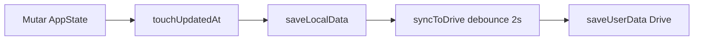
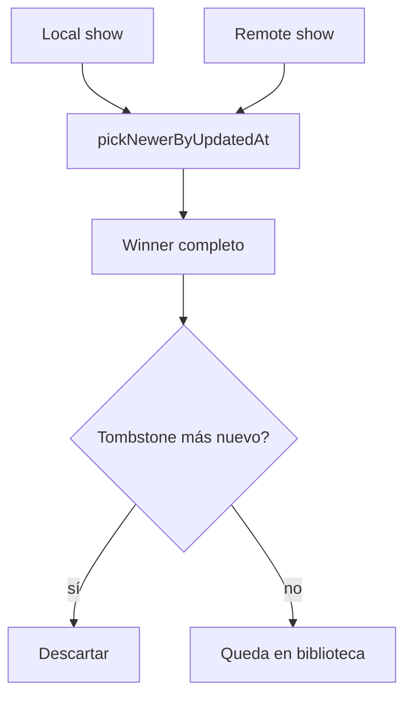

# 03 — Persistencia y sync

← [02 Modelo](02-modelo-de-datos.md) · [Índice](README.md) · Siguiente: [04 TMDB](04-tmdb.md)

---

## Propósito

Explicar cómo la biblioteca sobrevive a recargas, se espeja en Drive y se fusiona entre dispositivos sin un servidor propio.

---

## Claves de localStorage

| Clave | Contenido |
|-------|-----------|
| `seenit_data__${userId}` | Blob de biblioteca del usuario Google actual |
| `seenit_data` | Legacy; se migra una vez a la clave por usuario |
| `seenit_data_backup` | Snapshot local justo antes de un merge con Drive |
| `seenit_drive_user` | Info básica del usuario Drive (id, etc.) |
| `seenit_drive_token` | Access token + `expiresAt` (gestionado en `drive-service.js`) |
| `seenit_tmdb_seasons_v1` | Caché de temporadas TMDB (TTL 24 h) |

Funciones: `getDataStorageKey`, `loadLocalData`, `saveLocalData`, `migrateLegacyDataIfNeeded`.

---

## Ciclo local

Casi toda mutación relevante:

1. Cambia el ítem / tombstone.
2. `touchUpdatedAt(item)` → ISO ahora.
3. `saveLocalData()`.
4. `syncToDrive()` (debounce 2 s) o flush inmediato en casos críticos (p.ej. notas).

---

## Debounce y flush

| Mecanismo | Comportamiento |
|-----------|----------------|
| `syncToDrive()` | Programa `syncToDriveNow` en **2000 ms**; reinicia el timer si hay más cambios |
| `bindSyncFlushListeners` | Al ocultar pestaña (`visibilitychange` → `hidden`) o `pagehide`, cancela debounce y sube ya |
| `syncDirty` | Si llega un sync mientras `isSyncing`, al terminar se vuelve a llamar `syncToDriveNow` |

Condiciones para subir:

- `isAuthenticated()`
- `AppState.driveLoadOk` (ya hubo carga/reconciliación correcta en la sesión)

Si el token caduca a mitad, se muestra el gate de Drive.

---

## Pull / reconcile

`loadFromDrive` (también el botón **Sincronizar** del perfil):

1. Snapshot local (`snapshotLibrary`).
2. `loadUserData()` desde Drive.
3. `reconcileWithDriveData(remote, localSnapshot)`.
4. `saveLocalData` + según resultado, push local o dejar remoto.

### Resultados de `reconcileWithDriveData`

| Resultado | Cuándo | Acción típica |
|-----------|--------|----------------|
| `local-upload` | Drive vacío, local con datos | Aplicar local y subir |
| `merged` | Ambos con ítems | `mergeLibraries` |
| `remote` | Solo remoto (o remoto “más nuevo” vacío especial) | Aplicar remoto |
| `unchanged` | Ambos vacíos / sin cambios útiles | Nada |

Siempre se hace `backupLibraryBeforeMerge` antes.

---

## Merge LWW (`mergeLibraries`)

**Last-Write-Wins** por entidad (`id_tmdb` o `list.id`):

1. Unir tombstones (`mergeDeletedIds` / `mergeTombstoneLists`) quedándote con el `deletedAt` más reciente por id.
2. Para movies/shows: mapa por `id_tmdb`; si existe en ambos, `mergeMovieOrShow` → `pickNewerByUpdatedAt`.
3. Empate de `updatedAt`: gana el que tenga más `capitulos_vistos`.
4. Filtrar ítems tombstoned (`deletedAt >= updatedAt` del ítem).
5. Listas: por `id`; si colisionan por nombre+tipo, gana la más reciente.

**Importante:** no se hace unión ciega de episodios vistos entre dos versiones del mismo show. Gana **el documento entero** más reciente. Por eso conviene que cada toggle actualice `updatedAt`.

---

## Tombstones en la práctica

- `removeMovie` / `removeShow` → `recordItemTombstone` + quitar de listas.
- `addMovie` / `addShow` → `clearItemTombstone` para permitir re-añadir.
- Sin tombstones, un dispositivo con copia antigua reintroduciría el ítem borrado en el merge.

---

## Sync manual vs automática

| Acción | Función |
|--------|---------|
| Marcar episodio, editar crítica, etc. | `syncToDrive` automático |
| Perfil → Sincronizar | `loadFromDrive` (pull + merge + push según caso) |
| Conectar en gate | Flujo de `initApp` / `connectDriveFromGate` |

---

## Debug rápido

1. DevTools → Application → Local Storage: inspecciona `seenit_data__…` y `seenit_data_backup`.
2. Consola: logs `[App] Datos sincronizados`, `[Drive] …`.
3. Si no sube: ¿`driveLoadOk`? ¿autenticado? ¿errores 401?
4. Si “vuelven” borrados: mira `deletedIds` en ambos lados y timestamps.

Más checklist: [16 Guía de mantenimiento](16-guia-mantenimiento.md).

---

## Si quieres cambiar X, toca Y

| Cambio | Dónde |
|--------|--------|
| Tiempo de debounce | `syncToDrive` (2000) |
| Merge campo a campo (episodios) | Sustituir `mergeMovieOrShow` — decisión de producto delicada |
| Otra key de storage | `getDataStorageKey` + migración |
| Forzar sync inmediato tras X | Llamar `syncToDriveNow()` o el patrón de flush de notas |
