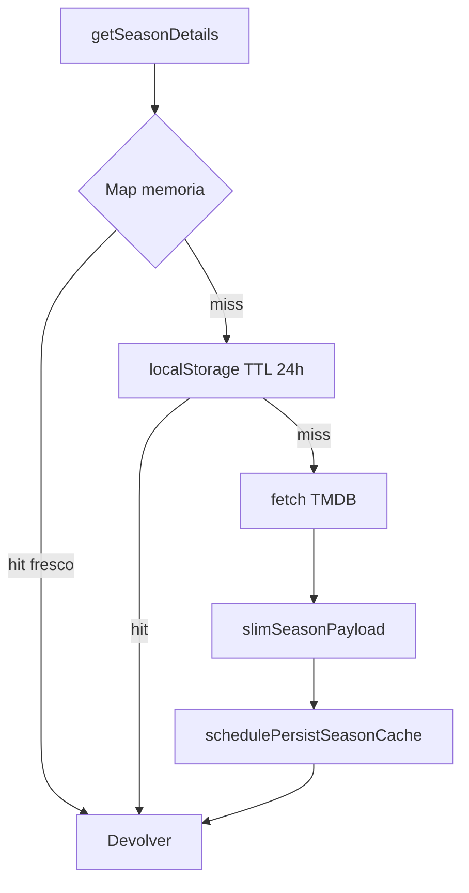

# 04 — TMDB

← [03 Sync](03-persistencia-y-sync.md) · [Índice](README.md) · Siguiente: [05 Drive](05-drive-oauth.md)

---

## Propósito

`tmdb-service.js` es el único cliente HTTP hacia The Movie Database. Normaliza respuestas al shape que usa SeenIt y cachea temporadas para no martillar la API en los timelines.

Config: `CONFIG_TMDB_API_KEY` en `config.js` (`getTmdbApiKey` / `hasTmdbConfig`).

---

## Constantes

| Constante | Valor / uso |
|-----------|-------------|
| `TMDB_BASE_URL` | `https://api.themoviedb.org/3` |
| `TMDB_IMAGE_BASE_URL` | `https://image.tmdb.org/t/p` |
| `SEASON_CACHE_STORAGE_KEY` | `seenit_tmdb_seasons_v1` |
| `SEASON_CACHE_TTL_MS` | 24 h |
| Región providers | Preferencia **ES**, fallback primer país |

---

## Endpoints usados (vía `fetchTMDB`)

| Función | Endpoint típico | Uso en app |
|---------|-----------------|------------|
| `searchMulti` / `searchMovies` / `searchTV` | `/search/...` | Explorar |
| `getMovieDetails` | `/movie/{id}` (+ appends según código) | Añadir / ficha |
| `getTVDetails` | `/tv/{id}` | Añadir / ficha |
| `getTVShowMeta` | Meta ligera / refresco | Timelines, temporada nueva |
| `getSeasonDetails` | `/tv/{id}/season/{n}` | Episodios ordenados, progreso |
| `getWatchProviders` | `/{type}/{id}/watch/providers` | Plataformas |
| `findByExternalId` | `/find/{id}` | Import TV Time |
| `findMovieByTitleYear` / `findTVByTitleYear` | search | Fallback import |

Imágenes: `getImageUrl(path, size)` → `w500`, etc.

---

## Normalización

| Función | Salida |
|---------|--------|
| `normalizeMovieData` | Película con `id_tmdb`, títulos, runtime, géneros, providers si vienen… |
| `normalizeTVData` | Serie + temporadas stub, runtime episodio, etc. |
| `normalizeSearchResult` | Fila de búsqueda unificada (`tipo`, póster, año) |

La app suele enriquecer después (estado usuario, crítica, etc.).

---

## Caché de temporadas

- `clearSeasonDetailsCache(tvId?)` — invalidar tras cambios estructurales o debug.
- Persistencia debounced para no escribir en cada episodio.

En timelines, `app.js` limita concurrencia con `TIMELINE_FETCH_CONCURRENCY = 8`.

---

## Watch providers (España)

`getWatchProviders(type, id)`:

1. Lee `results.ES` (o primer país).
2. Concatena `flatrate` + `rent` + `buy`.
3. Devuelve `{ provider_name, logo_path, … }`.

La **unificación de nombres** (Netflix vs “Netflix Standard with Ads”, etc.) no está en el servicio TMDB: está en `app.js` (`normalizeProviderName`, `FEATURED_PROVIDERS`). Ver [08](08-peliculas-y-filtros.md).

---

## Búsqueda con debounce

`searchWithDebounce(query, callback, 300)` — evita un request por tecla en Explorar. Mínimo 2 caracteres.

---

## Rate / errores

- Sin cola global aparte de la concurrencia del timeline.
- Errores: log + devolver vacío o throw según función; la UI muestra toasts.
- 401 → clave TMDB mal configurada (secret / `config.js`).

---

## API global

Exportado como `window.TMDBService` y también funciones sueltas (`window.getTVDetails`, …). Lista completa: [14](14-api-global-window.md).

---

## Si quieres cambiar X, toca Y

| Cambio | Dónde |
|--------|--------|
| País de providers | `getWatchProviders` (`ES`) |
| TTL caché temporadas | `SEASON_CACHE_TTL_MS` |
| Append de créditos/recs en detalle | `getMovieDetails` / `getTVDetails` + `openDetail` |
| Idioma de respuestas | `fetchTMDB` usa `language=es-ES` |
