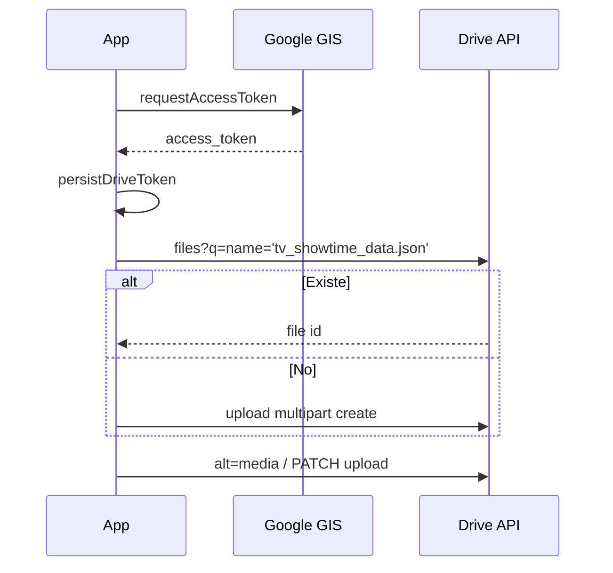

# 05 — Drive OAuth

← [04 TMDB](04-tmdb.md) · [Índice](README.md) · Siguiente: [06 Layout](06-navegacion-y-layout.md)

---

## Propósito

`drive-service.js` gestiona:

1. Login con **Google Identity Services** (GIS) — token OAuth.
2. Lectura/escritura del JSON de biblioteca en Drive del usuario.
3. Renovación silenciosa del token cuando aún es válido.

No usa `gapi.client.init` (problemático con API keys restringidas). Las llamadas son `fetch` a Drive v3 con `Authorization: Bearer`.

---

## Configuración

- Obligatorio: `CONFIG_GOOGLE_CLIENT_ID` (OAuth Web Client).
- Scope: `https://www.googleapis.com/auth/drive.file` (solo ficheros creados/abiertos por la app).
- Nombre del fichero: **`tv_showtime_data.json`** (`DATA_FILE_NAME`).
- `CONFIG_GOOGLE_API_KEY` es opcional / legacy en el cliente.

Orígenes autorizados en Google Cloud deben coincidir con `window.location.origin` (p.ej. `http://localhost:5500`, `https://usuario.github.io`).

---

## Token

| Pieza | Detalle |
|-------|---------|
| Storage | `seenit_drive_token` → `{ accessToken, expiresAt }` |
| Margen | `TOKEN_REFRESH_MARGIN_MS` = 5 min |
| `restoreAccessToken` | Al init, si el token sigue fresco |
| `ensureValidAccessToken({ interactive })` | Renueva; `interactive: true` abre popup si hace falta |
| `authenticate` | Login explícito (gate / conectar) |
| `signOut` | Limpia token y estado |

---

## Fichero de datos

| Función | Rol |
|---------|-----|
| `findOrCreateDataFile` | Query por nombre + `trashed=false`; si no, crea |
| `createDataFile` | Multipart upload con `{ movies, shows, lists }` vacío |
| `loadUserData` | `GET .../files/{id}?alt=media` |
| `saveUserData` | `PATCH` multipart; exige `movies` y `shows` |
| `resetDriveDataFileCache` | Olvida `dataFileId` en memoria (tras logout / cambio cuenta) |

`withDriveAuth`: si 401/403, pide token interactivo y reintenta una vez.

---

## Integración con la app

- Gate `#drive-gate` → `connectDriveFromGate`.
- Tras auth: `getUserInfo`, set `driveUserId`, cargar local por usuario, `loadUserData`, `reconcileWithDriveData`.
- Estado UI: `updateDriveStatus`, toasts de error con `formatDriveError`.

Detalle de merge: [03](03-persistencia-y-sync.md).

---

## Limitaciones del scope `drive.file`

- La app **no** lista todo el Drive del usuario.
- Solo ve el JSON que ella creó (o que el usuario abrió con la app en el flujo de picker, si se usara).
- Si el usuario borra `tv_showtime_data.json` en Drive, el siguiente `findOrCreate` crea uno vacío → riesgo de `local-upload` o pérdida si local también vacío. El backup `seenit_data_backup` ayuda en el navegador actual.

---

## Errores frecuentes

| Síntoma | Causa |
|---------|--------|
| `origin_mismatch` | Origen no listado en el Client ID |
| Popup bloqueado | Navegador bloquea GIS |
| Consent en “Prueba” | Solo test users |
| `CONFIG_MISSING` | Sin Client ID válido |
| Sesión caducada | Token expirado; gate vuelve a mostrarse |

---

## Si quieres cambiar X, toca Y

| Cambio | Dónde |
|--------|--------|
| Nombre del JSON | `DATA_FILE_NAME` (rompe continuidad) |
| Scope más amplio | `SCOPES` + pantalla de consentimiento Google |
| Forzar re-login | `signOut` + `clearPersistedDriveToken` |
| API Drive distinta | `driveFetch` / upload URLs |
