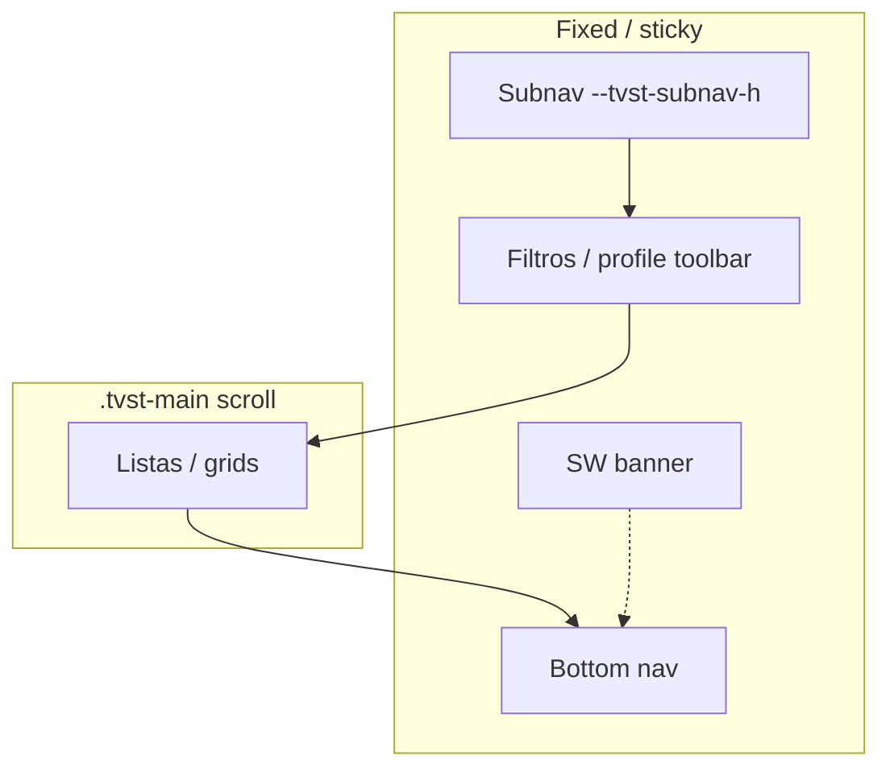

# 06 — Navegación y layout

← [05 Drive](05-drive-oauth.md) · [Índice](README.md) · Siguiente: [07 Timeline series](07-timeline-series.md)

---

## Propósito

Cómo se organizan pestañas, scroll y el “chrome” sticky (subnav, filtros, bottom nav, banner SW) para que no queden huecos ni el contenido quede bajo barras fijas.

---

## Estructura DOM (resumen)

```
#sw-update-banner          → encima del bottom nav (z-index alto)
#drive-gate                → login a pantalla completa
#app
  .tvst-app-shell
    main.tvst-main         ← contenedor de SCROLL principal
      #content-series
      #content-movies
      #content-explore
      #content-profile
    nav.tvst-bottom-nav    ← fijo abajo
  #detail-modal            ← sheet sobre el contenido
  #episode-modal
  …
```

**Regla de oro:** el scroll vertical de las listas vive en **`.tvst-main`**, no en `window`. Funciones `getScrollTop` / `setScrollTop` / listeners de timeline usan ese nodo.

---

## Tabs principales

`switchTab(tab)` con `tab ∈ { series, movies, explore, profile }`:

1. Cierra modales de detalle/episodio si están abiertos.
2. Actualiza `AppState.currentTab`.
3. En series: resetea historial visible a 0 (ancla en «Ver a continuación»).
4. Muestra `#content-${tab}`, marca botón bottom nav.
5. `renderCurrentView` + `scheduleSyncMobileChromeHeights`.
6. Series pending → `resetPendingListScroll`; perfil → scroll 0.

Bottom nav: botones `.tvst-bottom-nav-btn[data-tab="…"]` en `index.html`.

---

## Subnavegación

| Zona | Estado | Función |
|------|--------|---------|
| Series | `currentSubTab`: `pending-list` \| `upcoming` | `switchSubTab` |
| Películas | `currentMoviesSubTab` | `switchMoviesSubTab` |
| Perfil | `currentProfileTab` | `switchProfileTab` |

Subnavs usan clase `.tvst-subnav` sticky; altura medida → CSS var `--tvst-subnav-h`.

---

## Sticky chrome y medición

`syncMobileChromeHeights()`:

- Mide subnav activo, tabs de perfil y bottom nav.
- Escribe en `:root`:
  - `--tvst-subnav-h`
  - `--tvst-profile-tabs-h`
  - `--tvst-bottom-nav-h`
- Se llama **también en desktop** (antes solo móvil → huecos sticky).

`scheduleSyncMobileChromeHeights` hace doble `rAF` para medir tras layout.

Elementos sticky secundarios (filtros películas, toolbar perfil, cabecera favoritos) usan `top: calc(var(--tvst-subnav-h) - 2px)` (o equivalente con profile tabs) y a veces `box-shadow: 0 -2px 0 #000` para tapar el gap de 1px del border.

Ver [13 CSS](13-ui-css-convenciones.md).

---

## Bottom nav + modal

- `padding-bottom` del main incluye `--tvst-bottom-nav-h` + safe area.
- El sheet del detalle se alinea **por encima** del nav (CSS del modal).
- Banner SW: `z-index: 90`, también sobre el nav; no debe taparse al cambiar de tab.

Al cambiar de tab se cierran modales para no dejar estado huérfano.

---

## Safe areas

Variables `--tvst-safe-top` / `--tvst-safe-bottom` desde `env(safe-area-inset-*)` (notch / home indicator). Viewport: `viewport-fit=cover` en `index.html`.

---

## Diagrama de capas sticky (series / películas)



---

## Si quieres cambiar X, toca Y

| Cambio | Dónde |
|--------|--------|
| Nueva tab bottom | `index.html` + `switchTab` + `renderCurrentView` + CSS activo |
| Hueco bajo sticky | `syncMobileChromeHeights` + `top` del sticky + sombra anti-gap |
| Scroll anclado mal en timeline | [07](07-timeline-series.md) (`resetPendingListScroll`, observer) |
| Modal tapado por nav | CSS `#detail-modal` / sheet + padding bottom |
