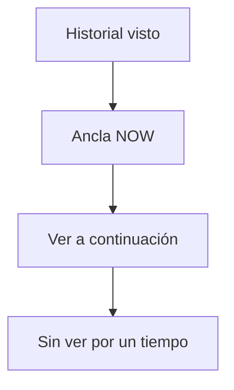

# 07 — Timeline de series

← [06 Layout](06-navegacion-y-layout.md) · [Índice](README.md) · Siguiente: [08 Películas](08-peliculas-y-filtros.md)

---

## Propósito

La pestaña **Series** tiene dos subvistas:

1. **Lista pendiente** — próximo episodio por ver de cada serie en estado `watching`, partida en *Ver a continuación* / *Sin ver por un tiempo*, más historial hacia arriba.
2. **Próximamente** — episodios con fecha de emisión futura (series no abandonadas).

Todo el scroll y el ancla viven en `.tvst-main` ([06](06-navegacion-y-layout.md)).

---

## Lista pendiente: anatomía

Orden visual (de arriba a abajo en el DOM):

1. **Historial** (episodios ya vistos) — parcialmente oculto; se revela al hacer scroll-up.
2. **Ancla** `data-timeline-anchor="pending-list"` — marca el inicio de “ahora”.
3. **Ver a continuación** — series con actividad reciente o `continueBoostAt`.
4. **Sin ver por un tiempo** — resto de `watching` con pendiente.

Al entrar en la tab, `timelineHistoryVisible['pending-list'] = 0` y `resetPendingListScroll` posiciona el scroll de forma que el ancla quede justo bajo el subnav sticky (historial queda “arriba” fuera de vista).

---

## Continue vs stale (14 días)

`isShowInContinueSection(show)`:

1. Si `continueBoostAt` tiene ≤ **14 días** → continue.
2. Si no hay actividad de visionado y 0 episodios vistos → continue (recién empezada).
3. Si la última actividad (`capitulos_vistos_fecha` / helpers) tiene ≤ 14 días → continue.
4. Si no → stale.

### `continueBoostAt`

Cuando una serie `completed` detecta **temporada nueva** en TMDB (`refreshCompletedShowsForNewSeasons`):

- Pasa a `watching`.
- `continueBoostAt = nowIso()`.
- Toast informativo.
- Entra en *Ver a continuación* aunque no hayas marcado episodios aún.

Normalizado en `normalizeStoredShow`.

---

## Build y caché

| Pieza | Rol |
|-------|-----|
| `buildWatchingPendingEntries` | Para cada show `watching`, obtiene el siguiente episodio no visto emitido |
| `rebuildPendingTimeline` | Separa continue/stale, guarda `timelinePendingCache`, pinta |
| `buildHistoryEntries` | Historial en background → `timelineHistoryCache` |
| `TIMELINE_CACHE_FRESH_MS` | 3 min: si el cache es fresco, pinta y refresca en background |
| `invalidateTimelineCaches` | Tras toggles / add / remove / etc. |
| `orderedEpisodesCache` | Episodios ordenados por serie (sesión) |
| Concurrencia | `TIMELINE_FETCH_CONCURRENCY = 8`, pools a 3 para meta |

`paintPendingTimeline` genera el HTML (filas, badges Nuevo/Último, checks).

---

## Ancla y scroll-up de historial

| Función | Qué hace |
|---------|----------|
| `getPendingListContentAboveAnchor` | Altura del contenido por encima del ancla |
| `getTimelineStickyOffset` | Compensa subnav medido |
| `resetPendingListScroll` | `scrollTop = above - stickyOffset`; habilita historial tras rAF |
| `anchorTimelineToNow` / `scrollToNowAnchor` | Re-centra (botón / API) |
| `handleTimelineScroll` | Si scroll-up cerca del tope y `__seenitHistoryLoadReady`, incrementa `timelineHistoryVisible` y re-pinta preservando ancla |
| `attachPendingAnchorResizeObserver` | Reajusta si el contenedor cambia de altura al cargar |

Flags globales útiles: `__seenitHistoryLoadReady`, `__seenitLastScrollY`, `pendingAnchorScrollGeneration` (cancela scrolls obsoletos).

Tras marcar un episodio visto: `bumpPendingHistoryAfterWatch` asegura al menos 1 fila de historial visible sin perder el ancla en continue.

---

## Próximamente

- Incluye series según estado (excluye `abandoned`).
- Cache en `timelineUpcomingCache`.
- Historial/paginación distinta (`timelineHistoryVisible.upcoming` arranca en 4).

---

## Badges de episodio

`getEpisodeBadges`: **Nuevo** (emitido ≤7 días y no visto), **Último** (último emitido de la serie).

---

## Si quieres cambiar X, toca Y

| Cambio | Dónde |
|--------|--------|
| Ventana 14 días | `isShowInContinueSection` / `getDaysSinceWatchActivity` |
| Criterio de “pendiente” | `buildWatchingPendingEntries` |
| Comportamiento al entrar | `switchTab` / `switchSubTab` + `resetPendingListScroll` |
| Temporada nueva | `refreshCompletedShowsForNewSeasons` + `ensureShowSeasonMeta` |
| TTL cache timeline | `TIMELINE_CACHE_FRESH_MS` |
