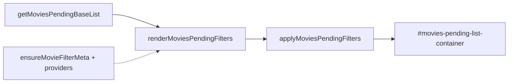

# 08 — Películas y filtros

← [07 Timeline](07-timeline-series.md) · [Índice](README.md) · Siguiente: [09 Perfil](09-perfil-listas-favoritos.md)

---

## Propósito

Subvista **Películas → Lista pendiente**: grid de pósters con filtros colapsables (género, plataforma, duración máxima). **Próximamente** lista estrenos futuros sin ese panel.

---

## Estado de filtros (`AppState`)

| Campo | Default | Significado |
|-------|---------|-------------|
| `moviesPendingGenreFilter` | `'all'` | Nombre de género o todas |
| `moviesPendingPlatformFilter` | `'all'` | Featured, `Otros`, o todas |
| `moviesPendingMaxRuntime` | `null` | Minutos máximos; `null` = sin tope |
| `moviesPendingFiltersOpen` | `false` | Panel expandido |

UI en `#movies-pending-filters` (sticky bajo el subnav).

---

## Flujo de render

1. `renderMoviesPendingList` — pinta chips + aplica filtros.
2. En background hidrata `generos`, `runtime` y `watch_providers` si faltan.
3. **Slider de duración en vivo:** `options.live` → solo `applyMoviesPendingFilters()` (no re-monta el panel, así el thumb no “salta”).

Handlers: `setMoviesPendingGenreFilter`, `setMoviesPendingPlatformFilter`, `setMoviesPendingMaxRuntime`, `toggleMoviesPendingFilters`.

---

## Plataformas featured + aliases

Lista canónica `FEATURED_PROVIDERS` en `app.js`:

Netflix, Prime Video, Disney+, Max, Movistar Plus+, Apple TV, SkyShowtime, RTVE, Atresplayer, Filmin, Rakuten.

`normalizeProviderName` mapea variantes TMDB (Amazon → Prime Video, HBO Max → Max, etc.).

- Chip de una featured: películas que, tras normalizar, incluyen ese nombre.
- Chip **Otros** (`PROVIDER_OTHER`): tiene al menos un provider **no** featured (`itemHasOtherProviders`).
- Misma normalización se reutiliza en selects de plataforma del **perfil**.

Orden de chips: `orderFilterChipValues` pone el activo justo después de “Todas”.

---

## Sticky del panel

CSS: `top: calc(var(--tvst-subnav-h) - 2px)`, `z-index: 40`, sombra superior para tapar el hueco del border del subnav. Alturas: `syncMobileChromeHeights` ([06](06-navegacion-y-layout.md)).

Chips: scroll horizontal en móvil; `flex-wrap` en desktop.

---

## Matching

`movieMatchesPendingFilters` combina género ∩ plataforma ∩ `runtime <= max`. Si hay tope de duración, las películas **sin** `runtime > 0` se excluyen.

Toggle visto en card: `toggleMovieWatched` (no confundir con filtros).

---

## Si quieres cambiar X, toca Y

| Cambio | Dónde |
|--------|--------|
| Añadir plataforma featured | `FEATURED_PROVIDERS` + alias en `normalizeProviderName` |
| Filtro nuevo (año, nota…) | Estado + `movieMatchesPendingFilters` + UI chips |
| Comportamiento live del slider | rama `options.live` en el render de filtros |
| Sticky gap | CSS `.tvst-movies-filters` + vars chrome |
