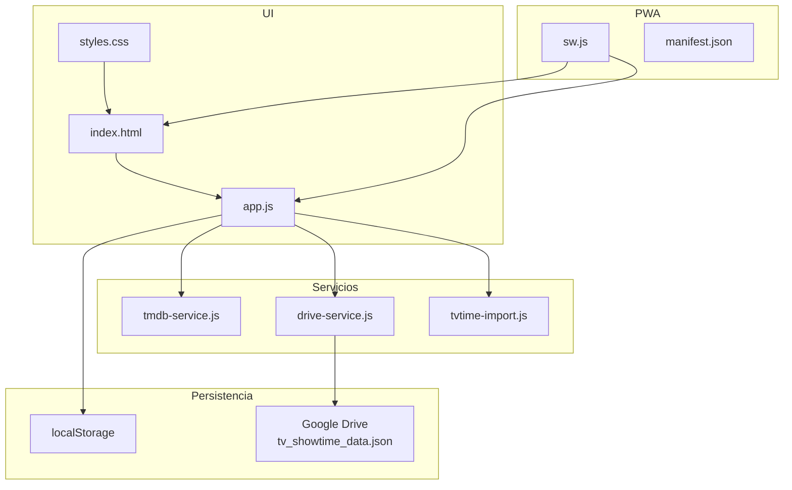

# Manual técnico de SeenIt

Documentación en español para **mantener** la app sin depender de un asistente y para **aprender** cómo está diseñada (PWA vanilla, sync Drive, TMDB, timelines).

La guía de instalación rápida y el checklist de Google Cloud / GitHub Pages siguen en el [README raíz](../README.md). Aquí está el “por qué” y el “dónde tocar”.

---

## Cómo leer este manual

### Si empiezas de cero
1. [01 — Visión y arquitectura](01-vision-y-arquitectura.md)
2. [02 — Modelo de datos](02-modelo-de-datos.md)
3. [06 — Navegación y layout](06-navegacion-y-layout.md)
4. [17 — Glosario](17-glosario.md)

### Si vas a cambiar comportamiento
1. El doc de la feature (07–12)
2. [15 — Decisiones](15-decisiones-y-historial.md) (contexto del *por qué*)
3. [16 — Guía de mantenimiento](16-guia-mantenimiento.md) (checklist práctico)

### Si algo de sync / login falla
1. [03 — Persistencia y sync](03-persistencia-y-sync.md)
2. [05 — Drive OAuth](05-drive-oauth.md)
3. [16 — Mantenimiento](16-guia-mantenimiento.md) → sección debug

---

## Mapa mental

---

## Índice

| # | Documento | Tema |
|---|-----------|------|
| 01 | [Visión y arquitectura](01-vision-y-arquitectura.md) | Qué es, capas, scripts, `AppState` |
| 02 | [Modelo de datos](02-modelo-de-datos.md) | Movie, Show, List, tombstones, campos |
| 03 | [Persistencia y sync](03-persistencia-y-sync.md) | localStorage, LWW, debounce, flush |
| 04 | [TMDB](04-tmdb.md) | Endpoints, normalización, caché, providers |
| 05 | [Drive OAuth](05-drive-oauth.md) | GIS, token, find/create/save JSON |
| 06 | [Navegación y layout](06-navegacion-y-layout.md) | Tabs, scroll, sticky chrome, modal |
| 07 | [Timeline series](07-timeline-series.md) | Pending/upcoming, ancla, continue vs stale |
| 08 | [Películas y filtros](08-peliculas-y-filtros.md) | Chips, providers, duración, colapso |
| 09 | [Perfil, listas, favoritos](09-perfil-listas-favoritos.md) | Biblioteca, stats, listas |
| 10 | [Ficha detalle](10-ficha-detalle.md) | Hero, nota, crítica, episodios, menú |
| 11 | [Import / export / TV Time](11-import-export-tvtime.md) | JSON backup, importadores |
| 12 | [PWA / Service Worker](12-pwa-service-worker.md) | Caché, bump, banner update |
| 13 | [UI / CSS](13-ui-css-convenciones.md) | Variables `--tvst-*`, sticky, componentes |
| 14 | [API global `window`](14-api-global-window.md) | `window.App`, handlers onclick |
| 15 | [Decisiones e historial](15-decisiones-y-historial.md) | Producto / técnica |
| 16 | [Guía de mantenimiento](16-guia-mantenimiento.md) | Features, SW, sync, deploy, traps |
| 17 | [Glosario](17-glosario.md) | LWW, tombstone, flatrate, continueBoost… |

---

## Criterios de esta documentación

- Cita archivos reales (`app.js`, `drive-service.js`, …).
- No incluye secrets ni el contenido de `config.js`.
- Si el código y un doc discrepan, **gana el código**; actualiza el doc.

---

## Correcciones frente a docs antiguos

| Antes (incorrecto / desfasado) | Ahora |
|---|---|
| Fichero Drive `seenit-data.json` | `tv_showtime_data.json` |
| Series nuevas como *Viendo* | Se añaden como **`pending`**; al marcar episodio → `watching` |
| SW sin versión documentada | Cachés `seenit-static-v52` / `seenit-dynamic-v52` |
